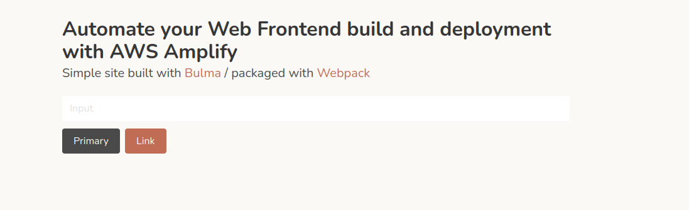
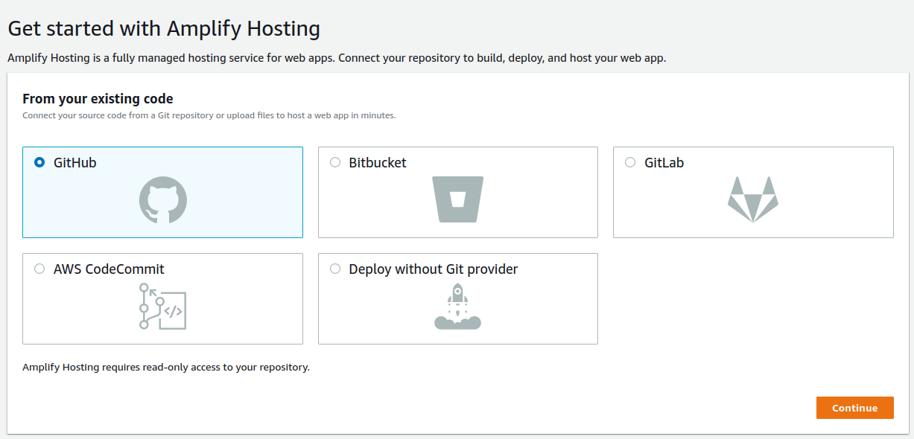
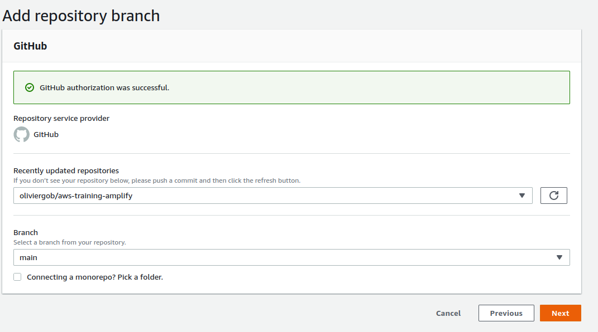
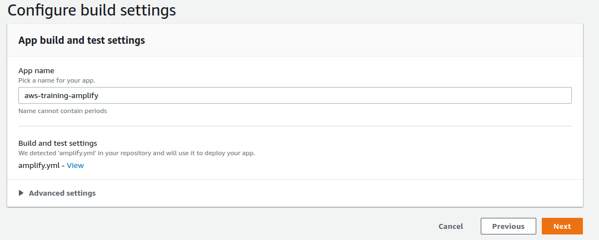
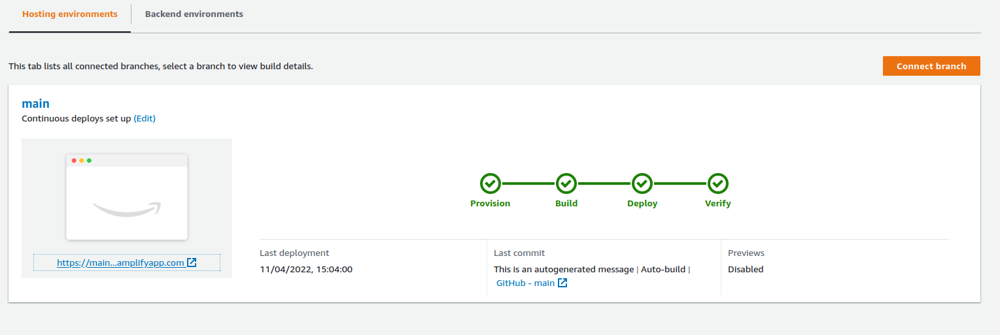

This blog post is part of series on [How to build and deploy a serverless web app on AWS](../20220226-build-webapp-aws/).


In this post we will learn two things:
* Create a simple webapp using Bulma CSS Framework and Webpack for packaging
* Automate the deployment of it using AWS Amplify

The first part is just so we have something to deploy. You can skip to the second one if you already have a Front End ready to deploy.
I use Bulma and Webpack for simplicity, the learnings here should apply with any other app framework or build tool.


## Creating the App
The steps below mostly follow [Bulma's documentation](https://bulma.io/documentation/customize/with-webpack/). Skip to the next section if you an app ready to deploy.

Create a new folder for your app and install webpack, bulma and the required dependencies:

```
mkdir my-web-app
cd my-web-app
npm init -y
npm install bulma --save-dev
npm install css-loader --save-dev
npm install extract-text-webpack-plugin@next --save-dev
npm install mini-css-extract-plugin --save-dev
npm install node-sass --save-dev
npm install sass-loader --save-dev
npm install style-loader --save-dev
npm install webpack --save-dev
npm install webpack-cli --save-dev
npm install webpack-dev-server --save-dev
npm install html-webpack-plugin --save-dev
```


Create a webpack.config.js file with the css loaders and a dev server for testing.

embed-url-code https://raw.githubusercontent.com/oliviergob/aws-training-amplify/main/webpack.config.js js


Create an src folder and a ```index.js``` file:

embed-url-code https://github.com/oliviergob/aws-training-amplify/blob/main/src/index.js js


Inside the same src folder, add a file called ```mystyles.scss```: 

embed-url-code https://raw.githubusercontent.com/oliviergob/aws-training-amplify/main/src/mystyles.scss css


Create a public directory and an ```index.html``` file inside of it:

embed-url-code https://raw.githubusercontent.com/oliviergob/aws-training-amplify/main/public/index.html html


You can now start the app using
```
npm start
```

You should get something like that:




## Deploying the App in Amplify

* create a file named ```amplify.yaml``` at the root of your repository. You can change or add build commands if you are using a different build tool or command
embed-url-code https://raw.githubusercontent.com/oliviergob/aws-training-amplify/main/amplify.yaml yaml


* In the AWS Console, navigate AWS Amplify
* Click on Get Started, and again on Get Started in Amplify Hosting
* Select your Git provider and click Continue

* Authenticate on your Git provider and authorize AWS Amplify to access your repositories
* Select your web Front End repository and the main branch and click Next

* Amplify should detect that you already have a build file, click Next

* Click Save and Deploy

* Amplify should succeed in building and deploying your app and give you a URL to access it


Congratulations!!! Your Front End is now live! Any commit pushed to the main branch will trigger the automated build and deployment process!