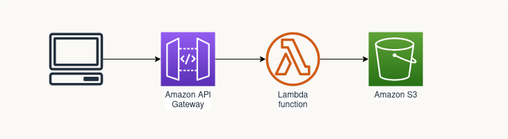

This blog post is part of series on [How to build and deploy a serverless web app on AWS](../20220226-build-webapp-aws/).


In this post we will:
* Create a simple Restful API using API Gateway and AWS Lambda
* Automate the deployment of those resources with AWS SAM

The API will be really simple and just read a file in an S3 bucket. It is unauthenticated and has just one method:
```GET /configuration```




A few definitions first:
* AWS Lambda is a serverless compute service. It allows us to execute a function in the language of our choice (Python in our case) without having to worry at all about the infrastructure beneath it
* API Gateway allows us to publish and manage Rest APIs and route them to Lambda functions
* CloudFormaion lets you provision and manage AWS resources (E.G. API Gateways, Lambda Functions...) by treating infrastructure as code
* Serverless Apllication Model (SAM) is AWS framework for building Serverless applications. It provides a wrapper around CloudFormation and simplifies the templates required to create the AWS resources we need

## Prerequesites

* [Install AWS CLI](https://docs.aws.amazon.com/cli/latest/userguide/getting-started-install.html)
* [Install AWS SAM CLI](https://docs.aws.amazon.com/serverless-application-model/latest/developerguide/serverless-sam-cli-install.html)
* [Install Python 3.9](https://www.python.org/downloads/)


## Build and deploy the stack


```
sam build
sam deploy --resolve-s3  --capabilities CAPABILITY_IAM --stack-name webapp-backend
```
