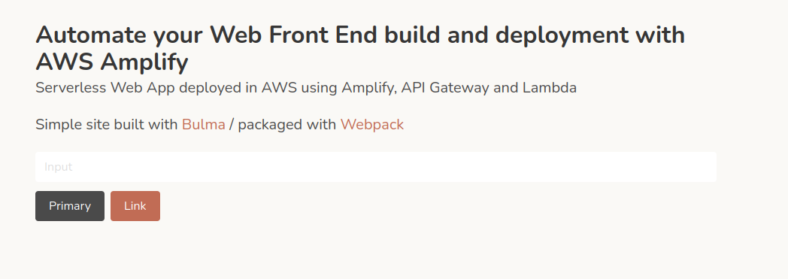

This blog post is part of a series on [How to build and deploy a serverless web app on AWS](../20220226-build-webapp-aws/).

You can find the whole source code in those repositories (branch part-03):
* [Front End](https://github.com/oliviergob/aws-tutorial-serverless-frontend/tree/part-03)
* [Back End](https://github.com/oliviergob/aws-tutorial-serverless-backend/tree/part-03)


If you are building a web app in AWS, chances are you will want to call your APIs from a local development Front End, or from a test instance without a domain name set up.
Although you can call API Gateway endpoints from the command line, the browser will refuse to make the call giving you an error like the following:

```
Cross-Origin Request Blocked: The Same Origin Policy disallows reading the remote resource at https://AAAAAAA.execute-api.us-east-1.amazonaws.com/prod/configuration. (Reason: CORS header ‘Access-Control-Allow-Origin’ missing). Status code: 200.
```

Cross-Origin Resource Sharing (CORS) are HTTP headers added by a server indicating to the browser which origins other than its own domain are allowed to make calls to the given resource.


## Calling the API from Front End

Let's add an element in the index.html to host the content of the API Call
```html
        <p class="subtitle" id='site_description'></p>
```

Then we can add the API call and add the restul to that element in the index.js:
```javascript
fetch('https://lx09ng1b5i.execute-api.us-east-1.amazonaws.com/prod/configuration').then(response =>{
    return response.json();
}).then(data =>{
    console.log(data.welcome_text);
    site_desciption.textContent =  data.welcome_text
})
```

If you refresh your site, you should see the CORS error in the console.


## Adding CORS to the Back End

The CORS headers can be added to the HttpApi object in the SAM ```template.yaml```:

```yaml
  HttpApi:
    Type: AWS::Serverless::HttpApi
    Properties:
      StageName: !Ref StageName
      CorsConfiguration:
        AllowOrigins:
          - '*'
        AllowMethods: 
          - GET
          - POST
          - OPTIONS
        AllowHeaders:
          - '*'
```

Though this won't be enough, this is just allowing the CORS headers to be passed back, they also need to be returned by the lambda function.
Edit the return statement in your lambda function ```resources/functions/configuration/function.py```

```python
    return {
        'statusCode': 200,
        'headers': {
            'Access-Control-Allow-Headers': '*',
            'Access-Control-Allow-Origin': '*',
            'Access-Control-Allow-Methods': 'GET,POST,OPTIONS'
        },
        'body': json.dumps(configfile)
    }
```


You can now refresh your web app. Hurray! The value returned from the API is displayed on your page!

